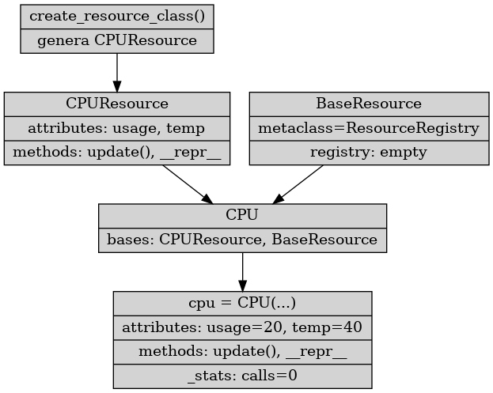

# 🛰️ Mini-Proyecto: ResourceMonitor

## 🎯 Objetivo

Mini-framework diseñado para practicar:

- Metaclases
- Decoradores avanzados
- Factories de clases
- Manipulación del namespace
- Dunder methods (__init__, __repr__)
- Registro automático de clases
- Lógica dinámica en tiempo de ejecución

El proyecto define un sistema que permite crear recursos monitorizados (CPU, RAM, GPU, sensores, etc.) dinámicamente, añadirles decoradores automáticos y centralizarlos mediante una metaclase registradora.

## 📁 Estructura del proyecto

```css
ResourceMonitor/
│
├── decorators.py        # Decoradores: log, timer, repeat, validate_args
├── factory.py           # Factoría para crear clases dinámicas de recursos
├── resource_monitor.py  # Metaclase que registra recursos
├── example_usage.py     # Demostración completa del proyecto
└── README.md            # Este documento
```

## 🧠 Conceptos que practica este mini-proyecto
✔ Metaclases

- ResourceRegistry registra cualquier clase que herede de BaseResource.

✔ Decoradores

- log_call registra la ejecución.
- timer mide duración.
- repeat(n) ejecuta varias veces.
- validate_args(types) valida los tipos en runtime.

✔ Class Factory

- create_resource_class() genera clases completas con métodos monitorizables.

✔ Namespaces

- Los métodos se añaden al namespace antes de crear la clase.

✔ Dunder Methods

- `__repr__` imprime el estado del recurso.

## Diagrama de flujo conceptual

```css
[ 1️⃣ Factory: create_resource_class  ]
       |
       | genera
       v
  ---------------------
  |  CPUResource       |  <- clase dinámica
  |-------------------|
  | attributes: usage  |
  | attributes: temp   |
  | methods: update()  |
  | methods: __repr__  |
  ---------------------
       |
       | hereda junto con BaseResource
       v
  ---------------------
  |      CPU           |  <- clase final
  |-------------------|
  | bases: CPUResource |
  |        BaseResource|
  ---------------------
       |
       | metaclase ResourceRegistry.__new__ se ejecuta
       v
  ---------------------
  | ResourceRegistry   |
  | registry['CPU'] = CPU |
  ---------------------
       |
       | CPU ahora registrada
       v
  ---------------------
  | instancia cpu = CPU(usage=20, temperature=40) |
  |-------------------|
  | atributos: usage=20, temperature=40          |
  | métodos: update(), __repr__                  |
  | estadísticas: _stats={'calls':0, 'errors':0}|
  ---------------------

```

```css
                   +----------------------+
                   | create_resource_class|
                   +----------------------+
                             |
                             v
                   +----------------------+
                   |     CPUResource      |
                   |-------------------- |
                   | attributes: usage,  |
                   |            temp     |
                   | methods: update(),  |
                   |          __repr__   |
                   +----------------------+
                             |
       +---------------------+---------------------+
       |                                           |
       v                                           v
+----------------------+                +----------------------+
|        CPU           |<---------------|   BaseResource       |
|--------------------- |                | metaclass=ResourceReg|
| bases: CPUResource    |                | registry: {}         |
|        BaseResource   |                +----------------------+
+----------------------+
             |
             v
+-------------------------------+
| instancia cpu = CPU(...)      |
|-------------------------------|
| attributes: usage=20, temp=40|
| methods: update(), __repr__   |
| stats: _stats={'calls':0}     |
+-------------------------------+

```
